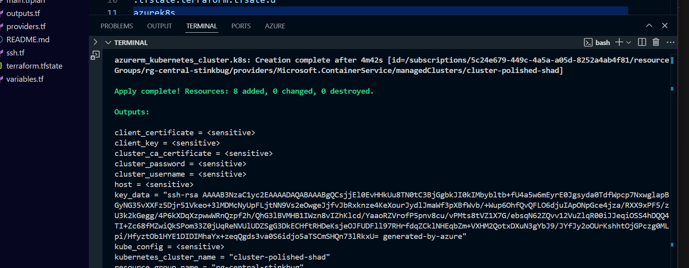
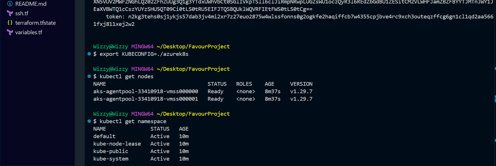
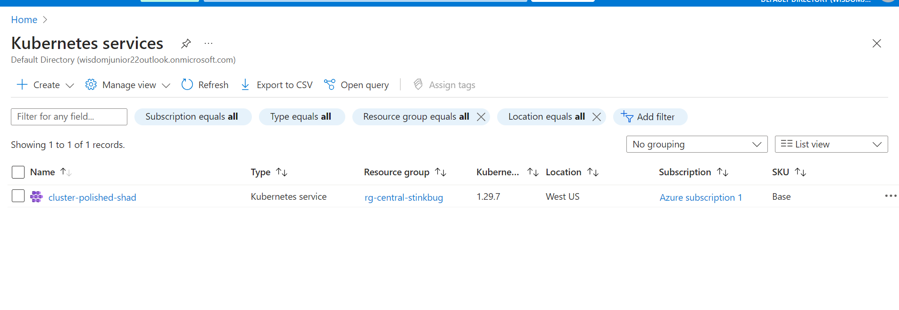
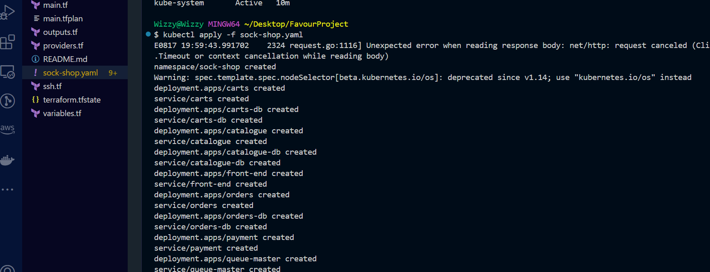
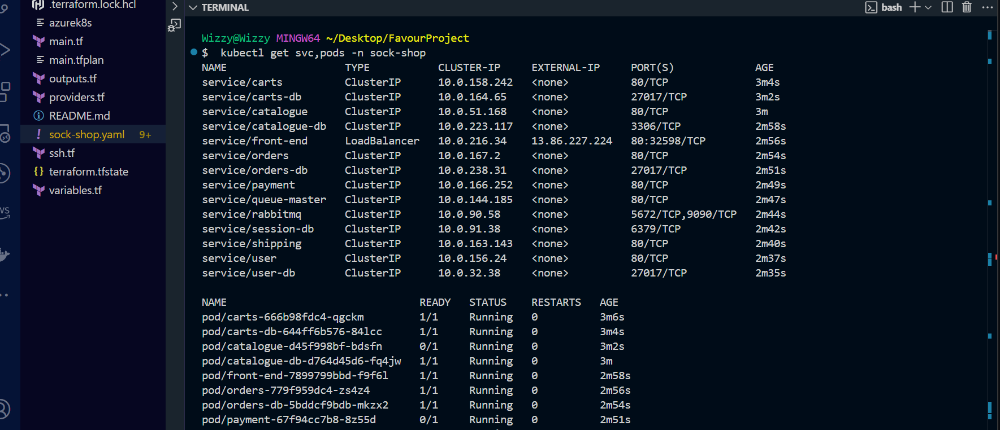
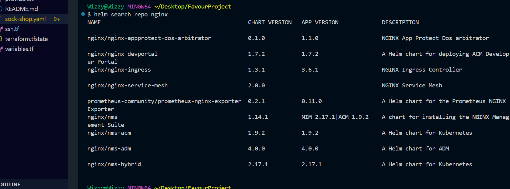
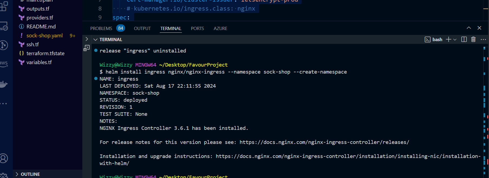
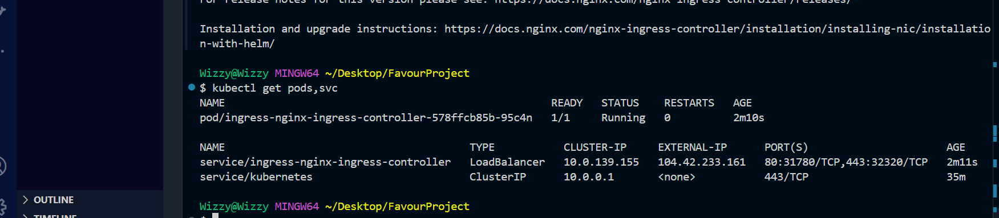
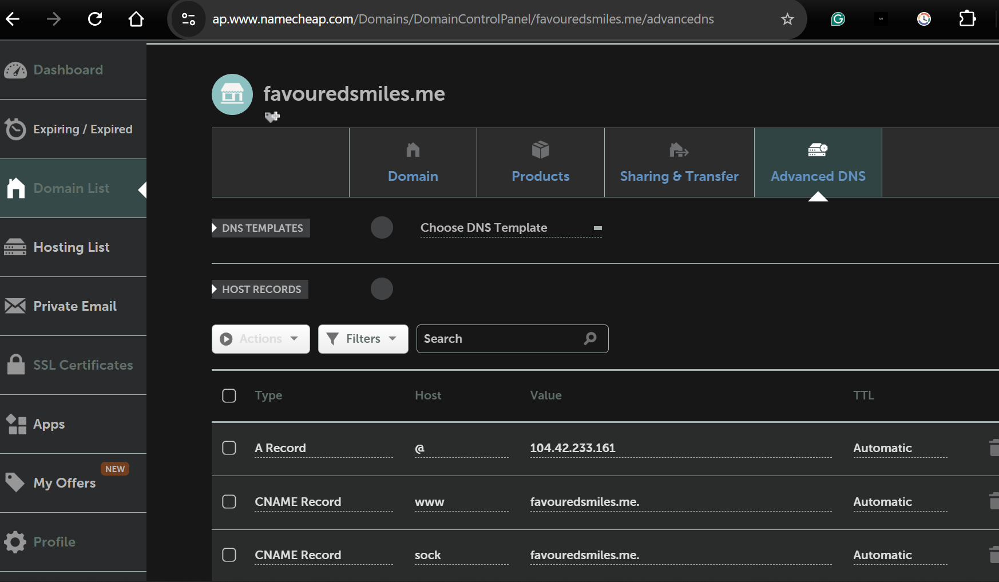
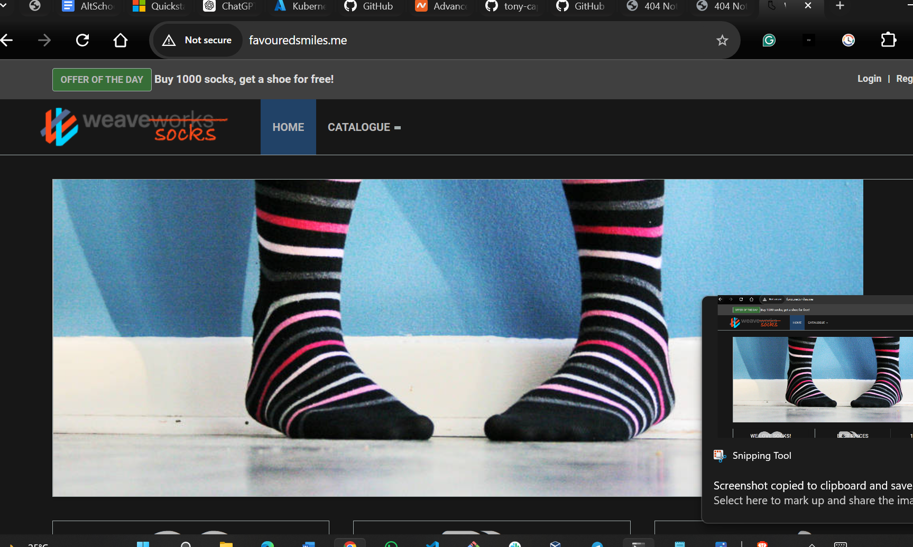

# Deploying Sockshop Microservices on Kubernetes with Modern Tools

### Goal:
> Deploy the Sockshop microservices application using a modern, automated approach with Infrastructure as Code (IaaC) for efficient and reliable Kubernetes deployment.

#### Project Summary
Sockshop is a popular microservices-based e-commerce demo application, showcasing various cloud-native technologies. It includes microservices for product catalog, shopping cart, and user authentication, designed for scalability and resilience. This project aims to deploy Sockshop on a Kubernetes cluster with an IaaC approach.

#### Requirements
To complete this project, you'll need:

- **Terraform**: To provision Azure infrastructure.
- **Azure Account**: For hosting the Kubernetes cluster and other cloud resources.
- **Kubernetes**: For managing and scaling microservices.
- **Helm**: To handle Kubernetes applications as Helm charts.
- **Sockshop Application**: The microservices-based e-commerce app being deployed.

**Infrastructure Setup**

Terraform will be used to set up the Azure infrastructure, ensuring a consistent and repeatable environment.

## Step 1: Initialize and Deploy Terraform Configuration

### Objective

The objective is to set up your working directory by initializing and deploying Terraform configurations to provision the required resources and Kubernetes cluster on Azure.

### Instructions

1. **Prepare Terraform Configuration Files**

   Ensure you have created and configured the following Terraform files in your working directory:
   - `providers.tf`
   - `ssh.tf`
   - `main.tf`
   - `variables.tf`
   - `outputs.tf`

2. **Initialize Terraform**

   Start by initializing Terraform to prepare your working environment with the necessary files and modules. 
   
   Use the commands:

   `terraform init --upgrade`

   `terraform plan -out main.tf.plan`

    `terraform apply main.tf.plan`

    

3. **Verify Cluster Health and Namespaces**

    After applying Terraform and provisioning the required resources, it’s important to verify the health of the Kubernetes cluster and confirm the active namespaces. Follow these steps:

4. **Check Cluster Health**

    Use the following command to ensure that all nodes in the cluster are healthy:

    `kubectl get nodes`
    
     then followed by

    `kubectl getnamespace`

- You can also check the Azure portal to confirm that the Kubernetes service is operational and running smoothly.

5. 
    We have been provided with the link *https://github.com/microservices-demo/microservices-demo/tree/master* to provision the Sockshop microservice application. We will use the YAML file from this repository to handle the deployment. The required .yaml file can be accessible in the deploy folder from the link.

    

6.
     Once the application deployment is complete, we need to ensure it is operating correctly. Use the following command to check the status:

`kubectl get pods,svc -n sockshop`

7. **Install an Ingress Controller**

    To effectively manage traffic routing to our pods and facilitate external access to our application, it is crucial to install an ingress controller. The ingress controller will direct incoming traffic to the appropriate services within our cluster.

- To begin, you need to add the appropriate repository and then search for the ingress controller using Helm. Execute the following command.

`helm search repo nginx`

- Once you have identified the specific ingress controller you want to install, proceed with the installation using Helm. For this, you will use the command:

`helm install ingress nginx/nginx-ingress --namespace sock-shop --create-namespace`

- After completing the installation, verify that the ingress controller has been successfully deployed. To do this, use the following command:

`kubectl get pods,svc`

    - Additionally, take note that the ingress controller will have an external IP address, such as `104.42.233.161`, which is accessible through port 80 and is used to serve the frontend of your application.

    - However, accessing your application via this IP address is not considered a best practice. Instead, you should map this external IP address to your designated domain name to ensure a more professional and user-friendly access method.

8. **Step 5: Configure Domain Name*

    To make your application accessible through a custom domain, follow these steps using *https://namecheap.com* as your domain hosting service. 

- **Update Domain DNS Settings**

   Navigate to Namecheap and modify the DNS settings for your domain name, which in this case is *favouredsmiles.me*. You will need to configure the domain to point to the external IP address provided by the nginx-ingress. This ensures that users can access your application through the domain name instead of the raw IP address.

   By mapping the external IP to your domain, you create a more professional and user-friendly way for accessing your application.

   

9. **Step 6: Access the Sock-shop Application**

    In this final step, open your web browser and navigate to the domain name you have configured. You should now be able to view your application through the custom domain you set up.

    *http://favouredsmiles.me*

     

